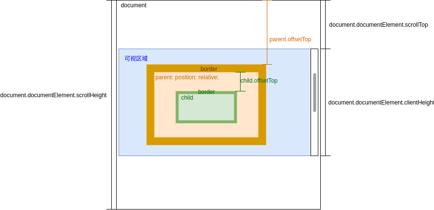

## 原理

对网页加载速度影响最大的就是图片，一张普通的图片可能会有好几 M 的大小，当图片很多时，网页的加载速度变得很缓慢。

为了优化网页性能以及用户体验，我们对图片进行`懒加载`。

懒加载是一种对网页性能优化的方式，它的原理是优先加载在可视区域内的图片，而不一次性加载所以图片。当浏览器滚动，图片进入可视区时再去加载图片。通过设置图片的 `src` 属性来让浏览器发起图片的请求。当这个属性为空或者没有时，就不会发送请求。

## 实现

::: 注意
此文所涉及的懒加载皆是在垂直方向上的滚动加载，横向滚动暂不考虑。
:::

懒加载的实现主要是判断当前图片是否到了可视区域这一核心逻辑。我们先来整理一下实现思路：

 1. 拿到所有的图片 `img dom` 。
 2. 遍历每个图片判断当前图片是否到了可视区范围内。
 3. 如果到了就设置图片的 src 属性。
 4. 绑定 window 的 `scroll` 事件，对其进行事件监听。

#### HTML 结构

```html
<div class="container">
    <div class="img-area">
        
    </div>
    <div class="img-area">
        
    </div>
    <div class="img-area">
        
    </div>
    <div class="img-area">
        
    </div>
    <div class="img-area">
        
    </div>
    <div class="img-area">
        
    </div>
</div>
```

此时 img 标签是没有 src 属性的，我们把真实的图片地址放在一个属性里，这里我们使用 HTML5 的 `data` 属性，将真实地址放在自定义的 `data-src` 中。

#### 判断图片是否进入了可视区域

这一逻辑有两种方法，听我娓娓道来。

**方法一**

第一种方法我们通过计算该图片距离 `document` 顶部的高度是否小于当前可视区域相对于 document 顶部高度来判断。

可视区域相对于 document 顶部高度的计算方法：

```javascript
const clientHeight = document.documentElement.clientHeight; // 视口高度，也就是窗口的高度。
const scrollHeight = document.documentElement.scrollTop + clientHeight; // 滚动条偏移文档顶部的高度（也就是文档从顶部开始到可视区域被抹去的高度） + 视口高度
```

画了一张图方便理解：



然后就是计算该图片距离文档顶部的高度。有两种方法，第一种方法是通过元素的 `offsetTop` 属性来计算。从上图我们了解到元素的 offsetTop 属性是相对于一个 `position` 为 `非 static ` 的祖先元素，也就是 `child.offsetParent` 。同时需要将祖先元素的 `border` 考虑在内，我们通过`child.offsetParent.clientTop`可以拿到边框厚度。

由此我们得到元素距离文档顶部的高度的计算方法：

```javascript
function getTop(el, initVal) {
    let top = el.offsetTop + initVal;
    if (el.offsetParent !== null) {
        top += el.offsetParent.clientTop;
        return getTop(el.offsetParent, top);
    } else {
        return top;
    }
}
```

这里的这个方法使用了 `尾递归调用` 。可以提高递归性能。当然这里也可以用循环来实现：

```javascript
function getTop(el) {
    let top = el.offsetTop;
    var parent = el.offsetParent;
    while(parent !== null) {
        top += parent.offsetTop + parent.clientTop;
        parent = parent.offsetParent;
    }
    return top;
}
```

第二种方法是使用 `element.getBoundingClientRect()` API 直接得到 top 值。

getBoundingClientRect 的返回值如下图：


```javascript
var first  = document.getElementById('first');
getTop(first, 0);  // 130
console.log(first.getBoundingClientRect().top); // 130
```

于是我们得到判断方法：

```javascript
function inSight(el) {
    const clientHeight = document.documentElement.clientHeight;
    const scrollHeight = document.documentElement.scrollTop + clientHeight;
    // 方法一
    return getTop(el, 0) < scrollHeight;
    // 方法二
    // return el.getBoundingClientRect().top < scrollHeight;
}
```

接下来就是对每个图片进行判断和赋值。

```javascript
function loadImg(el) {
    if (!el.src) {
        el.src = el.dataset.src;
    }
}

function checkImgs() {
    const imgs = document.getElementsByTagName('img');
    Array.from(imgs).forEach(el => {
        if (inSight(el)) {
            loadImg(el);
        }
    })
    console.log(count++);
}
```

最后给 window 绑定 `onscroll` 事件以及 `onload` 事件：

```javascript
window.addEventListener('scroll', checkImgs, false);
window.onload = checkImgs;
```

我们知道类似 `scroll` 或 `resize` 这样的事件浏览器可能在很短的时间内触发很多次，为了提高网页性能，我们需要一个**节流**函数来控制函数的多次触发，在一段时间内（如 500ms）只执行一次回调。

```javascript
/**
 * 持续触发事件，每隔一段时间，只执行一次事件。
 * @param fun 要执行的函数
 * @param delay 延迟时间
 * @param time 在 time 时间内必须执行一次
 */
function throttle(fun, delay, time) {
    var timeout;
    var previous = +new Date();
    return function () {
        var now = +new Date();
        var context = this;
        var args = arguments;
        clearTimeout(timeout);
        if (now - previous >= time) {
            fun.apply(context, args);
            previous = now;
        } else {
            timeout = setTimeout(function () {
                fun.apply(context, args);
            }, delay);
        }
    }
}
window.addEventListener('scroll', throttle(checkImgs, 200, 1000), false);
```

**方法二**

HTML5 有一个新的 `IntersectionObserver` API，它可以自动观察元素是否可见。

主要用法：

```javascript
var observer = new IntersectionObserver(callback, option);

// 开始观察
observer.observe(document.getElementById('first'));

// 停止观察
observer.unobserve(document.getElementById('first'));

// 关闭观察器
observer.disconnect();
```

目标的可见性发生变化时就会调用观察器的 callback。

```javascript
function callback(changes: IntersectionObserverEntry[]) {
    console.log(changes[0])
}

// IntersectionObserverEntry
{
    time: 29.499999713152647,
    intersectionRatio: 1,
    boundingClientRect: DOMRectReadOnly {
        bottom: 144,
        height: 4,
        left: 289,
        right: 293,
        top: 140,
        width: 4,
        x: 289,
        y: 140
    },
    intersectionRect: DOMRectReadOnly,
    isIntersecting: true,
    rootBounds: DOMRectReadOnly,
    target: img#first
}
```

详细释义：

- time：可见性发生变化的时间，是一个高精度时间戳，单位为毫秒
- intersectionRatio：目标元素的可见比例，即intersectionRect占boundingClientRect的比例，完全可见时为1，完全不可见时小于等于0
- boundingClientRect：目标元素的矩形区域的信息
- intersectionRect：目标元素与视口（或根元素）的交叉区域的信息
- rootBounds：根元素的矩形区域的信息，getBoundingClientRect()方法的返回值，如果没有根元素（即直接相对于视口滚动），则返回null
- isIntersecting：是否进入了视口，boolean 值
- target：被观察的目标元素，是一个 DOM 节点对象

使用 IntersectionObserver 实现图片懒加载：

```javascript
function query(tag) {
    return Array.from(document.getElementsByTagName(tag));
}
var observer = new IntersectionObserver(
    (changes) => {
        changes.forEach((change) => {
            if (change.intersectionRatio > 0) {
                var img = change.target;
                img.src = img.dataset.src;
                observer.unobserve(img);
            }
        })
    }
)
query('img').forEach((item) => {
    observer.observe(item);
})
```

完整代码见 [github](https://github.com/hentaicracker/new-blog/blob/vuepress/source/lazyload.html)

完 :)