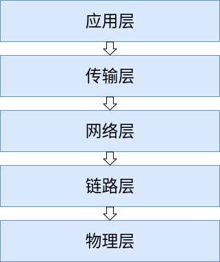
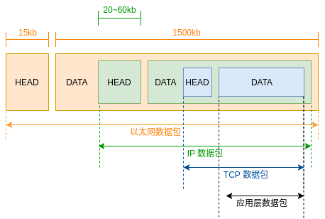

互联网改变了世界，也深刻地影响着你我他，通过互联网网络通信我们可以聊天、游戏、看直播等等等等。互联网网络通信是通过一系列的基础通讯协议来实现的，这篇文章的主要目的是为了梳理为什么有这些协议以及这些协议的作用是什么。

废话不多说，赶紧入主题。

一般，我们把互联网分成五层。分别是`物理层`，`数据链路层`，`网络层`，`传输层`，`应用层`。每一层都有相应的`协议`来规定这个层的作用和用法。如下图所示。

数据的包装形式如下图。

<!-- more -->

## 物理层

顾名思义，物理层其实就是实实在在的硬件层，把一个个电脑连起来组成一个网络，不管你是用电缆、光缆、无线电波还是动感光波都行，只要能传递 `0` 和 `1` 的电信号就行。物理层是最基础的层。

物理层功能：
- 为终端设备提供传送数据通路
- 传输数据

物理层的协议有很多，比如 `USB` ， `Bluetooth`蓝牙协议，电话协议 `modems` 等。

常见的物理层设备比如网卡、光纤、串口、U盘等。

## 数据链路层

这一层是规定了电信号的解读方式，比如多少位为一组信号。数据链路层确定了 0 和 1 的分组方式。每一组电信号构成一个数据链路数据单元，称为`数据帧`或`帧`。并对帧定界、同步、收发顺序的控制。

常见的链路层协议有`以太网`，`无线局域网（Wi-Fi）`和`通用分组无线服务（GPRS）`等。

### 以太网

我们主要说以太网，因为它是计算机连接协议中用的最多且最广泛的，它是一个局域网协议。

以太网协议功能：

- 为每台计算机分配 MAC 地址
- 通过广播发送数据

以太网规定每一个数据帧分成两个部分：**标头**和**数据**。标头主要是数据包的说明项比如发送者、接受者、数据类型等。数据则是数据包的具体内容。标头的长度固定为 18 字节，数据的长度最短为 46 字节，最长为 1500 字节。

以太网规定，连入网络的所有设备都必须有网卡接口，数据包必须从一块网卡传到另一块网卡。网卡的地址就是数据包的发送地址和接受地址，这叫做 `MAC` 地址。每块网卡都有一个独一无二的地址。

有了地址之后，以太网通过一种`广播`的方式来发送数据。比如 A 网卡想要给同一个网络下的 B 网卡，A 需要给该网络下所有连接的网卡发送数据包，每个网卡解析数据标头，看接受者的`MAC`地址是不是自己的地址，是就进一步处理，不是就丢掉。这种方式就叫广播。

至此，数据链路层就可以在多台计算机之间传送数据了。

## 网络层

如果说中国的网络是个大的局域网，深圳的网卡去找北京的网卡难道要广播一下，告诉全中国的电脑我要找北京的某某某？想想也不可能啊，全中国那么多电脑和手机，这样搞得搞死。

那要怎么找呢？在这种情况下网络层横空出世。它主要是引进一套新的地址，使得我们能够区分不同的计算机是否为同一个子网络。这套地址就叫网址。

网络层使用 `IP地址` 来唯一标识互联网上的设备，依靠 IP 地址进行相互通讯。

常见的网络协议有 `IP` 、`ICMP` 等。

### IP 协议

IP 协议功能：

- 为每台计算机分配 IP 地址
- 确定哪些地址在同一个子网络

目前我们广泛采用的是 IP 协议第四版，也就是 `IPv4` ，这个版本规定网络地址由 32 个二进制位组成。我们习惯上用分成四段的十进制数表示 IP 地址。如 `192.168.0.1`。IP 地址的范围从 0.0.0.0 到 255.255.255.255 。前一部分表示网络，后一部分代表主机，如果IP地址网络部分相同那这两个地址就在同一个子网络中。如 `192.168.0.1` 和 `192.168.0.123` 处在同一个子网络中。

那怎么判断网络部分呢？通过`子网掩码`。子网掩码网络部分全部为 1 ，主机部分全为 0 。比如一个 IP 地址的网络部分为前 24 位，主机部分为后 8 位，表示为二进制就是  11111111.11111111.11111111.00000000 ，十进制就是 255.255.255.0 。通过子网掩码与两个 IP 地址进行 `AND` 运算，然后比较结果是否相同，如果相同就在同一个子网络下。

IP 协议规定 IP 数据包标头部分的长度为 20 到 60 字节，整个数据包的总长度最大为 65535 字节。而以太网的数据包最长只有 1500 字节，如果 IP 数据包长度超过了 1500 字节就需要分割成几个以太网数据包分开发送。

那我知道了目标对象的 IP 地址，是通过什么方式去找这个 IP 呢？答案是[路由](https://zh.wikipedia.org/wiki/%E8%B7%AF%E7%94%B1)。这个涉及范围比较广不作详述。

不过一般我们都是通过域名去访问一个服务。比如 `hentaicracker.github.io`，如何通过这个域名来找到它的 IP 地址呢？通过 [DNS](https://zh.wikipedia.org/wiki/%E5%9F%9F%E5%90%8D%E7%B3%BB%E7%BB%9F) 来查询 IP 地址。

## 传输层

传输层的作用是建立**端口到端口**的通讯。一般我们使用计算机都会同时启动多个程序，比如边打开浏览器浏览网页边听音乐啥的。这些应用程序会占用计算机的一个端口。

### UDP 协议

UDP 协议就是在数据前面加上端口号。它也是由标头和数据两个部分组成，放入 IP 数据包的数据部分。

数据在 IP 中传送时会被封装为数据报文，它的传送机制不保证数据能否准确的传输。数据包在到达的时候可能已经损坏，顺序错乱，产生冗余包，或全部丢失。如果应用需要保证可靠性就需要上层的协议来控制。UDP 协议只管端口号，并不管你丢不丢数据，所以为了更加安全地传送数据 `TCP` 协议横空出世。

### TCP 协议

TCP 协议的主要目的就是提高网络传送数据的可靠性。简单点说它就是一个有确认机制的 UDP 协议。你发送一个数据过来，你要先告诉我，我说好你可以发过来，你再发过来。发完你你说发完了，我再跟你确认一下，然后你也确认一下，好，关闭连接。

TCP 数据包长度理论上没有限制。前面我们说 IP 数据包过大会分开发送，于是 TCP 为了保证不丢包，就给每个包一个序号，同时序号也保证了传送到接收端实体的包的按序接收。然后接收端实体对已成功收到的包返回一个确认(`ACK`);如果在发送端规定时间内没收到确认，那么就会认为这个已丢失然后重新传。TCP 用一个校验和函数来检验数据是否有错误，在发送和接收时都要计算校验和。

详细戳 [传输控制协议 - TCP](https://zh.wikipedia.org/wiki/%E4%BC%A0%E8%BE%93%E6%8E%A7%E5%88%B6%E5%8D%8F%E8%AE%AE)。

## 应用层

终于到这里了，应用层直接面向用户。你看直播，发邮件，聊微信。各种数据五花八门，应用层就负责规定这些数据格式。

常见的应用层协议有 [HTTP](http://hentaicracker.github.io/2018/02/26/http/)、`FTP`、`SMTP`、`SSH`、`DNS`、`DHCP`、`RPC`等。

## 参考资料

[OSI模型 - wikipedia](https://zh.wikipedia.org/wiki/OSI%E6%A8%A1%E5%9E%8B)

[互联网协议入门](http://www.ruanyifeng.com/blog/2012/05/internet_protocol_suite_part_i.html)